  <picture>
    
  </picture>

    
  
  <!-- Dynamic Typing Animation -->
  
  
    
  
  <!-- Professional Social Badges (Fully Linked, No Placeholders) -->
  
  
  
  
  
  
    
  <!-- Dynamic Visitor Counter -->
  

 

## 🌌 Executive Summary

I am a **Software Engineer** and final-year B.Tech CSE student (Class of 2027) based in Kanpur, specializing in high-performance backend systems and scalable full-stack architectures. I bridge the gap between complex algorithmic problem-solving (DSA) and production-ready enterprise development.

As the Founder and CEO of **Nexyra Systems**, I actively lead the architectural design and deployment of robust software solutions, heavily optimizing for SEO, Lighthouse scores, and sub-second latency. I am deeply passionate about building AI-integrated support models, microservices in Java Spring Boot, and cinematic, highly responsive frontend interfaces. 

- 🚀 **Core Focus:** Distributed Systems, RESTful API Design, Relational Database Management, and Cloud Deployments.
- 🧠 **Continuous Learning:** Rigorously practicing advanced DSA (NPTEL preparations) and scaling applications via Docker & AWS.
- 🎯 **Goal:** Seeking SDE roles at top-tier product-based companies (Google, Microsoft, Amazon, Meta) where I can contribute to mission-critical, large-scale systems.

 

## ⚙️ Engineering Arsenal

<table style="border: none; border-collapse: collapse;">
  <tr style="border: none;">
    <td valign="top" width="50%" style="border: none;">
      <h3>Core & Backend</h3>
      

        
        
        
        
        
        
      

    </td>
    <td valign="top" width="50%" style="border: none;">
      <h3>Frontend & UI/UX</h3>
      

        
        
        
        
      

    </td>
  </tr>
  <tr style="border: none;">
    <td valign="top" width="50%" style="border: none;">
      <h3>Databases & Cloud</h3>
      

        
        
        
        
      

    </td>
    <td valign="top" width="50%" style="border: none;">
      <h3>DevOps & Tools</h3>
      

        
        
        
        
      

    </td>
  </tr>
</table>

 

## 📊 GitHub Analytics

  

 

<table align="center" style="border: none; background-color: transparent;">
  <tr style="border: none; background-color: transparent;">
    <td align="center" style="border: none; background-color: transparent;">
      
    </td>
    <td align="center" style="border: none; background-color: transparent;">
      
    </td>
  </tr>
</table>

  

 

## ⚔️ LeetCode Statistics

  

 

## 💻 Flagship Projects

| Project / Architecture | Details & Features | Links |
| :--- | :--- | :--- |
| **Green Habit Ecosystem**   *MERN Stack, Tailwind, Vercel* | Architected a comprehensive 29-page localized platform for Kanpur. Engineered isolated portals for NGOs, Universities, and Corporate sectors to manage and track sustainable habits securely. Implemented JWT-based role authentication and optimized MongoDB aggregations for real-time leaderboards. | [Source](https://github.com/Abhay924/green-habit)   [Live](https://green-habit.vercel.app) |
| **Nexyra Systems Dashboard**   *React, Node.js, Express, MongoDB* | Developed an "MNC-level" administrative dashboard to manage cross-border B2B tech clients. Features include real-time project tracking, automated invoice generation, and SEO-optimized dynamic routing. Strict adherence to clean architecture and IBM/Accenture code quality standards. | [Source](https://github.com/Abhay924/nexyra-dashboard)   [Live](https://nexyrasystems.com) |
| **NEXA AI / Dharti MITRA**   *Python, Spring Boot, OpenAI API* | Integrated generative AI models to create context-aware custom chatbots capable of bilingual (English/Hindi) customer support. Designed the Spring Boot middleware to manage rate limiting and session persistence, significantly reducing customer response times. | [Source](https://github.com/Abhay924/nexa-ai)   [Live](https://nexa-ai.vercel.app) |
| **Java Spring REST Engine**   *Java, Spring Boot, MySQL, Hibernate* | Built a scalable, monolithic backend service utilizing Spring Security and RESTful principles. Engineered robust exception handling, DTO mapping, and complex native SQL queries to ensure sub-100ms API response times for financial transaction logging. | [Source](https://github.com/Abhay924/spring-rest-api)   [Live](#) |

 

## 🏆 Certifications & Achievements

- 🏅 **IBM AI Fundamentals:** Certified understanding of machine learning models and AI integration.
- 🏅 **Java Programming & DSA (NPTEL):** Advanced university-level assessment in Data Structures, Algorithms, and DBMS.
- 🏅 **SQL Intermediate (HackerRank):** Proven ability to write complex joins and optimized subqueries.
- 🏅 **Continuous Open Source Contributor:** Actively refactoring legacy codebases to improve Lighthouse performance metrics.

 

## 🐍 Contribution Graph & Activity

  <picture>
    <source media="(prefers-color-scheme: dark)" srcset="https://raw.githubusercontent.com/Abhay924/Abhay924/output/github-contribution-grid-snake-dark.svg">
    <source media="(prefers-color-scheme: light)" srcset="https://raw.githubusercontent.com/Abhay924/Abhay924/output/github-contribution-grid-snake.svg">
    
  </picture>

 

  

