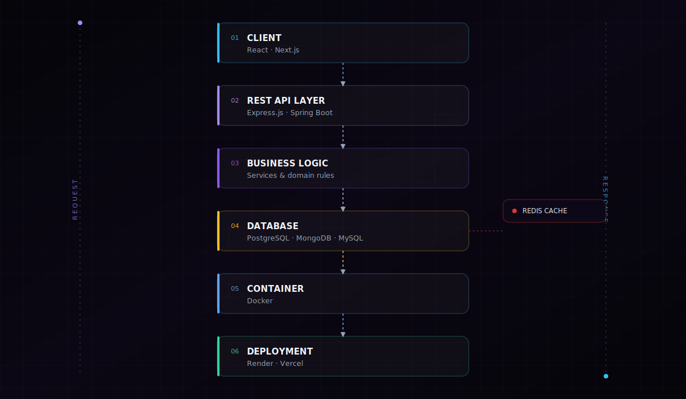

 

📍 Kanpur, Uttar Pradesh, India &nbsp;·&nbsp; 🎓 Final Year B.Tech CSE, Graduating 2027

 

Rendered once at page load — primary stack, active project count, and current learning focus in a single glance instead of scattered across badge rows.

  

##  System Identity

 

##  About

<table>
<tr>
<td width="58%" valign="top">

I'm a Computer Science Engineering student focused on **backend engineering**, **full-stack development**, and **software architecture** — Java and Spring Boot as my primary toolkit, React/Next.js on the front end.

My priority is writing clean, maintainable code and shipping real systems, while continuously sharpening **DSA**, **system design**, and engineering fundamentals.

 

| | |
|---|---|
| 🔭 **Building** | CareerOS AI — an AI-powered career operating system |
| 🌱 **Deepening** | Spring Boot internals, distributed system design, Docker/K8s |
| 💬 **Ask me about** | Java, backend architecture, microservices, full-stack systems |
| 📫 **Reach me** | abhaykushwaha06@gmail.com |
| 🎓 **Graduating** | 2027 — B.Tech, Computer Science Engineering |

</td>
<td width="42%" valign="top">

</td>
</tr>
</table>

 

##  Infrastructure Overview

General pattern I build with across projects — decoupled frontend, an API layer, service logic, persistent storage, containerized where applicable. Representative, not a diagram of one specific deployed system.

 

##  Technology Stack

<table align="center">
<tr>
<td valign="top" width="25%">

**Languages**

</td>
<td valign="top" width="25%">

**Frontend**

</td>
<td valign="top" width="25%">

**Backend**

</td>
<td valign="top" width="25%">

**Data & DevOps**

</td>
</tr>
</table>

<b>Tooling:</b> Git · GitHub Actions · VS Code · IntelliJ IDEA · Postman · Render · Vercel · Linux

 

##  Projects

<table>
<tr>
<td width="100%" valign="top">

### 🧠 CareerOS AI — Flagship Project
Global AI-powered career operating system — ten specialized agents covering resume generation, ATS analysis, company research, interview prep, and skill-gap analysis.

`Next.js` `Fastify / TypeScript` `PostgreSQL` `Prisma` `Redis` `BullMQ` `AI APIs`
**Status:** 🟢 Active Development

[Full case study →](./.github/profile/projects.md#careeros-ai) &nbsp;|&nbsp; 🔒 Private repository

</td>
</tr>
</table>

 

<table>
<tr>
<td width="50%" valign="top">

### 🌱 Green Habit Tracker
Sustainability and habit-tracking platform — user dashboards, CO₂ tracking, leaderboard, and NGO support.

`HTML` `CSS` `JavaScript` `Firebase` `Node.js` `MySQL`
**Status:** ✅ Completed

[Repository →](https://github.com/Abhay924/Green-Habit-) &nbsp;|&nbsp; [Case study →](./.github/profile/projects.md#green-habit-tracker)

</td>
<td width="50%" valign="top">

### 🥛 Smart Dairy Store
Inventory and dairy management app — authentication, product management, payment integration, admin dashboard.

`React Native` `Node.js` `Express.js` `MongoDB` `Firebase` `Razorpay`
**Status:** 🟡 In Development

[Case study →](./.github/profile/projects.md#smart-dairy-store) &nbsp;|&nbsp; 🔒 Private repository

</td>
</tr>
<tr>
<td width="50%" valign="top">

### 🛒 E-Commerce Microservices Platform
14-service backend — Spring Boot, Keycloak auth, event-driven order flow via Kafka, full observability stack.

`Java 21` `Spring Boot 3` `Kafka` `Redis` `Elasticsearch` `Docker`
**Status:** ✅ Completed

[Case study →](./.github/profile/projects.md#ecommerce-microservices-platform) &nbsp;|&nbsp; 🔒 Private repository

</td>
<td width="50%" valign="top">

### 🏢 Nexyra Systems Website
Software company website — service showcase, AI chatbot integration, premium responsive UI.

`Next.js` `React` `Tailwind CSS` `Node.js` `MongoDB` `OpenAI API`
**Status:** 🟢 Active

[Live site →](https://nexyrasystems.com) &nbsp;|&nbsp; [Case study →](./.github/profile/projects.md#nexyra-systems-website)

</td>
</tr>
</table>

Each case study covers architecture, folder structure, challenges, lessons learned, and roadmap — in <a href="./.github/profile/projects.md"><code>projects.md</code></a>.

 

##  Architecture References

<table align="center">
<tr>
<td align="center" width="25%">📐 <b><a href="./.github/diagrams/system-design.md">System Design</a></b></td>
<td align="center" width="25%">⚙️ <b><a href="./.github/diagrams/backend-architecture.md">Backend Architecture</a></b></td>
<td align="center" width="25%">🚀 <b><a href="./.github/diagrams/deployment-flow.md">Deployment Flow</a></b></td>
<td align="center" width="25%">🌐 <b><a href="./.github/diagrams/network-topology.md">Network Topology</a></b></td>
</tr>
</table>

 

##  Engineering Analytics

All figures above are rendered live by official GitHub stats services or generated by the <code>metrics.yml</code> workflow — nothing on this page is hardcoded.

 

##  Engineering Timeline

| Year | Milestone |
|---|---|
| **2023** | Started learning programming and web development |
| **2024** | Built multiple frontend and backend projects; strengthened Java fundamentals |
| **2025** | Began building full-stack applications, AI integrations, and scalable backend systems |
| **2026** | Built CareerOS AI, the e-commerce microservices platform, Green Habit Tracker, Smart Dairy Store, and Nexyra Systems — while preparing for software engineering roles |

 

##  Learning Roadmap

- [x] Java fundamentals and object-oriented design
- [x] Full-stack development with React and Node.js
- [x] Spring Boot — building production-style microservices
- [ ] System Design — deepening scalable architecture patterns
- [ ] Cloud & CI/CD — AWS, Kubernetes in production contexts
- [ ] Contributing to open-source Java / Spring projects

 

##  Certifications

<table align="center">
<tr>
<td align="center" width="20%">☁️ <b>IBM AI Fundamentals</b></td>
<td align="center" width="20%">🗄️ <b>SQL (Intermediate)</b> HackerRank</td>
<td align="center" width="20%">☕ <b>Java Programming</b></td>
<td align="center" width="20%">🤖 <b>AI Foundation</b></td>
<td align="center" width="20%">🧩 <b>Full Stack Development</b></td>
</tr>
</table>

Issuers and dates shown only where verifiable.

 

##  Contact

 

⚡ Built with handcrafted SVG dashboards and zero fabricated metrics.
 
🔄 Auto-synced via GitHub Actions — see <code>.github/workflows/</code>

