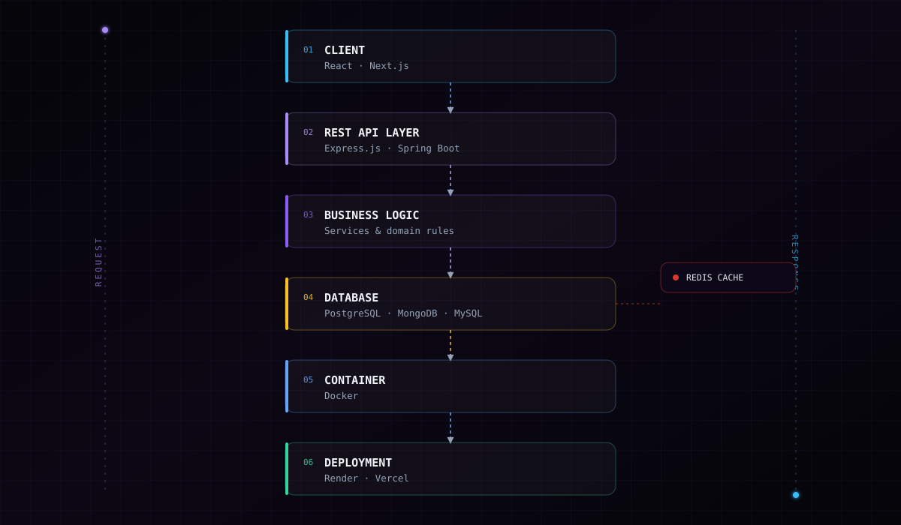

 

📍 Kanpur, Uttar Pradesh, India &nbsp;•&nbsp;
🎓 Final Year B.Tech Computer Science Engineering (2023–2027)

 

  

# 🖥️ System Identity

 

# 👨‍💻 About Me

<table>
<tr>

<td width="58%" valign="top">

Final-year **Computer Science Engineering** student passionate about building **scalable backend systems**, **modern full-stack web applications**, and **AI-powered products**.

My primary stack includes **Java**, **Spring Boot**, **React**, **Next.js**, **PostgreSQL**, and **Docker**. I enjoy designing clean architectures, writing maintainable code, and continuously improving my engineering skills through real-world projects.

Currently focused on strengthening backend engineering fundamentals while learning **System Design**, **Cloud Technologies**, and **production-ready software development**.

 

| | |
|---|---|
| 🚀 **Building** | CareerOS AI — AI-powered Career Platform |
| 🌱 **Learning** | System Design, Docker, Kubernetes |
| 💡 **Interests** | Backend Engineering, Cloud, AI |
| 💬 **Ask Me About** | Java, Spring Boot, REST APIs, React |
| 📫 **Email** | abhaykushwaha06@gmail.com |
| 🎓 **Graduation** | B.Tech CSE • 2027 |

</td>

<td width="42%" valign="top">

</td>

</tr>
</table>

 

# 🏗️ Infrastructure Overview

Typical architecture used across my projects—modern frontend, REST APIs, relational databases, and containerized deployments with Docker.

 

 

## 🛠️ Technology Stack

 

<table align="center">
<tr>

<td width="25%" valign="top">

### 💻 Languages

Java • JavaScript • TypeScript • Python • C++ • SQL

</td>

<td width="25%" valign="top">

### 🎨 Frontend

React • Next.js • Tailwind CSS • Bootstrap

</td>

<td width="25%" valign="top">

### ⚙️ Backend

Spring Boot • Node.js • Express.js • REST APIs

</td>

<td width="25%" valign="top">

### ☁️ Data & DevOps

PostgreSQL • MongoDB • MySQL • Firebase • Redis • Docker

</td>

</tr>
</table>

 

### 🧰 Development Toolkit

 

Git • GitHub • GitHub Actions • VS Code • IntelliJ IDEA • Postman • Docker • Linux • Vercel

---

## 🚀 Featured Projects

<table>

<tr>

<td width="100%" valign="top">

### ⭐ CareerOS AI Flagship Project

AI-powered career platform that helps students prepare for software engineering roles through intelligent resume analysis, ATS optimization, company research, interview preparation, and personalized learning paths.

#### Tech Stack

`Next.js` • `Fastify` • `TypeScript` • `PostgreSQL` • `Prisma` • `Redis` • `BullMQ` • `OpenAI API`

#### Key Highlights

- 🤖 AI Resume Analysis
- 📄 ATS Compatibility Checker
- 🏢 Company Research
- 🎯 Interview Preparation
- 📊 Skill Gap Analysis
- 🧩 Modular Backend Architecture

**Status:** 🟢 Active Development

📖 **Case Study:** `./.github/profile/projects.md#careeros-ai`

🔒 **Repository:** Available during technical interviews.

</td>

</tr>

</table>

 

<table>

<tr>

<td width="50%" valign="top">

### 🌱 Green Habit Tracker

Sustainability-focused web platform for habit tracking, environmental awareness, CO₂ analytics, leaderboards, and community engagement.

#### Tech Stack

`HTML` • `Tailwind CSS` • `JavaScript` • `Firebase`

**Status:** ✅ Completed

🔗 **Repository:**  
[Green Habit Tracker](https://github.com/Abhay924/Green-Habit-)

📖 **Case Study:**  
`./.github/profile/projects.md#green-habit-tracker`

</td>

<td width="50%" valign="top">

### 🛒 Smart Dairy Store

Full-stack retail management platform featuring authentication, inventory management, payment integration, order processing, and an administrative dashboard.

#### Tech Stack

`React Native` • `Node.js` • `Express.js` • `MongoDB` • `Firebase` • `Razorpay`

**Status:** 🟡 In Progress

🔒 **Repository:** Private

📖 **Case Study:**  
`./.github/profile/projects.md#smart-dairy-store`

</td>

</tr>

<tr>

<td width="50%" valign="top">

### ⚙️ E-Commerce Microservices

Learning project focused on building scalable backend services using an event-driven microservices architecture.

#### Tech Stack

`Java 21` • `Spring Boot 3` • `Kafka` • `Redis` • `Elasticsearch` • `Docker`

#### Engineering Concepts

- Event-Driven Architecture
- Microservices
- Keycloak Authentication
- Containerization
- Distributed Messaging

**Status:** ✅ Completed

🔒 **Repository:** Private

📖 **Case Study:**  
`./.github/profile/projects.md#ecommerce-microservices-platform`

</td>

<td width="50%" valign="top">

### 🏢 Nexyra Systems

Modern corporate website featuring responsive design, AI chatbot integration, inquiry management, and SEO optimization.

#### Tech Stack

`Next.js` • `React` • `Tailwind CSS` • `Node.js` • `MongoDB`

**Status:** 🟢 Active

🌐 **Live Website:**  
[nexyrasystems.com](https://nexyrasystems.com)

📖 **Case Study:**  
`./.github/profile/projects.md#nexyra-systems-website`

</td>

</tr>

</table>

 

> 💡 **Every project documents its architecture, technical decisions, implementation approach, trade-offs, challenges, and lessons learned—showcasing the engineering process, not just the final outcome.**

 

*"Building software that is reliable, scalable, and designed to solve real-world problems."*

  

##  Architecture References

<table align="center">
<tr>
<td align="center" width="25%">📐 <b><a href="./.github/diagrams/system-design.md">System Design</a></b></td>
<td align="center" width="25%">⚙️ <b><a href="./.github/diagrams/backend-architecture.md">Backend Architecture</a></b></td>
<td align="center" width="25%">🚀 <b><a href="./.github/diagrams/deployment-flow.md">Deployment Flow</a></b></td>
<td align="center" width="25%">🌐 <b><a href="./.github/diagrams/network-topology.md">Network Topology</a></b></td>
</tr>
</table>

 

##  Engineering Analytics

<!-- ========================= Engineering Analytics ========================= -->

  

### 📈 Contribution Activity

<!-- Activity Graph -->

  

### 🐍 Contribution Snake

<picture>
  <source media="(prefers-color-scheme: dark)"
    srcset="https://raw.githubusercontent.com/Abhay924/Abhay924/output/github-contribution-grid-snake-dark.svg">
  <source media="(prefers-color-scheme: light)"
    srcset="https://raw.githubusercontent.com/Abhay924/Abhay924/output/github-contribution-grid-snake.svg">
  
</picture>

  

### 🚀 Profile Highlights

  <i>✨ Every commit represents a step toward building impactful software.</i>

## 🚀 Engineering Timeline

| Year | Milestone |
|------|-----------|
| **2023** | Started B.Tech in Computer Science & Engineering. Learned C, C++, HTML, CSS, JavaScript, Git/GitHub, and programming fundamentals. |
| **2024** | Built frontend applications with React.js and backend APIs using Node.js & Express.js. Strengthened problem-solving skills through DSA while improving DBMS, OOPs, and SQL concepts. |
| **2025** | Developed full-stack MERN applications using MongoDB and Firebase. Built projects including Green Habit Tracker and gained experience with REST APIs, authentication, and cloud deployment. |
| **2026** | Building scalable applications such as CareerOS AI, Smart Dairy Store, and Nexyra Systems while preparing for Software Engineer roles by strengthening DSA, backend development, and system design. |
 

##  Learning Roadmap

- [x] Java fundamentals and object-oriented design
- [x] Full-stack development with React and Node.js
- [x] Spring Boot — building learning-scale microservices
- [ ] System Design — scalable architecture patterns
- [ ] Cloud & CI/CD — AWS, Kubernetes fundamentals
- [ ] Contributing to open-source Java / Spring projects

 

##  Certifications

<table align="center">
<tr>
<td align="center" width="20%">☁️ <b>IBM AI Fundamentals</b></td>
<td align="center" width="20%">🗄️ <b>SQL (Intermediate)</b> HackerRank</td>
<td align="center" width="20%">☕ <b>Java Programming</b></td>
<td align="center" width="20%">🤖 <b>AI Foundation</b></td>
<td align="center" width="20%">🧩 <b>Full Stack Development</b></td>
</tr>
</table>

 

##  Contact

 

🔄 Stats and activity graphs above update automatically via GitHub Actions — see <code>.github/workflows/</code>

