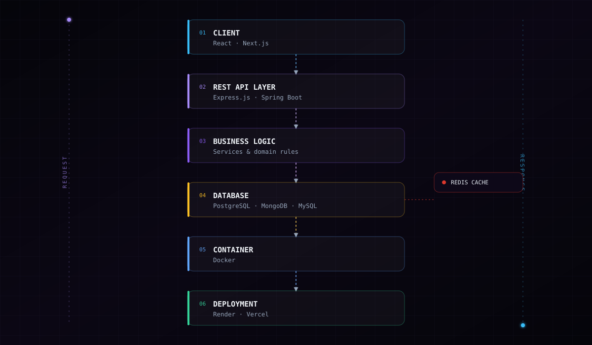

  

  

📍 Kanpur, Uttar Pradesh, India • 🎓 Final Year B.Tech Computer Science Engineering (2023–2027)

 

  

# 🖥️ System Identity

 

# 👨‍💻 About Me

<table>
<tr>

<td width="58%" valign="top">

Final-year **Computer Science Engineering** student passionate about building **scalable backend systems**, **modern full-stack web applications**, and **AI-powered products**.

My primary stack includes **Java**, **Spring Boot**, **React**, **Next.js**, **PostgreSQL**, and **Docker**. I enjoy designing clean architectures, writing maintainable code, and continuously improving my engineering skills through real-world projects.

Currently focused on strengthening backend engineering fundamentals while learning **System Design**, **Cloud Technologies**, and **production-ready software development**.

 

| | |
|---|---|
| 🚀 **Building** | CareerOS AI — AI-powered Career Platform |
| 🌱 **Learning** | System Design, Docker, Kubernetes |
| 💡 **Interests** | Backend Engineering, Cloud, AI |
| 💬 **Ask Me About** | Java, Spring Boot, REST APIs, React |
| 📫 **Email** | abhaykushwaha06@gmail.com |
| 🎓 **Graduation** | B.Tech CSE • 2027 |

</td>

<td width="42%" valign="top">

</td>

</tr>
</table>

 

# 🏗️ Infrastructure Overview

Typical architecture used across my projects—modern frontend, REST APIs, relational databases, and containerized deployments with Docker.

 

 

## 🛠️ Technology Stack

 

<table align="center">
<tr>

<td width="25%" valign="top">

### 💻 Languages

Java • JavaScript • TypeScript • Python • C++ • SQL

</td>

<td width="25%" valign="top">

### 🎨 Frontend

React • Next.js • Tailwind CSS • Bootstrap

</td>

<td width="25%" valign="top">

### ⚙️ Backend

Spring Boot • Node.js • Express.js • REST APIs

</td>

<td width="25%" valign="top">

### ☁️ Data & DevOps

PostgreSQL • MongoDB • MySQL • Firebase • Redis • Docker

</td>

</tr>
</table>

 

### 🧰 Development Toolkit

 

Git • GitHub • GitHub Actions • VS Code • IntelliJ IDEA • Postman • Docker • Linux • Vercel

---

## 🚀 Featured Projects

<table>
<tr>
<td width="100%" valign="top">

### 🚗 Smart Parking System

An ANPR-based smart parking project focused on automating vehicle entry, parking session tracking, billing, and payment verification before vehicle exit.

#### Frontend
`React` • `TypeScript` • `HTML5` • `CSS3`

#### Backend & Database
`Java 21` • `Spring Boot 3` • `Spring Security` • `Spring Data JPA` • `PostgreSQL` • `Flyway`

#### Tools
`Maven` • `Spring Actuator`

#### Key Highlights

- 🚘 Automatic Number Plate Recognition integration
- 🅿️ Vehicle entry and parking session management
- 🧾 Parking duration and fee calculation
- 💳 Payment verification workflow before exit
- 🗄️ Database persistence and schema migrations
- 🩺 Backend health monitoring

**Status:** 🟡 Active Development

🔗 **Repository:** [Smart Parking](https://github.com/Abhay924/Smart_Parking-)

</td>
</tr>
</table>

 

<table>
<tr>
<td width="100%" valign="top">

### ⭐ CareerOS AI Flagship Project

An AI-powered career platform in development, designed to help students prepare for software engineering roles through resume improvement, company research, interview preparation, and personalized learning guidance.

#### Frontend
`Next.js` • `React` • `TypeScript`

#### Backend & Database
`NestJS` • `PostgreSQL` • `Prisma` • `JWT`

#### Tools
`Turborepo` • `pnpm` • `Git`

#### Key Highlights

- 🤖 AI-powered career assistance
- 📄 Resume analysis and ATS optimization roadmap
- 🏢 Company and role research
- 🎯 Interview preparation workflows
- 📊 Skill-gap identification and learning guidance
- 🔐 Authentication and modular API architecture

**Status:** 🟢 Active Development

🔗 **Repository:** [CAREEROS-AI](https://github.com/Abhay924/CAREEROS-AI)

</td>
</tr>
</table>

 

<table>
<tr>
<td width="50%" valign="top">

### 🌱 Green Habit Tracker

A sustainability-focused application designed to help users track eco-friendly habits, build consistent routines, and monitor progress toward a greener lifestyle.

#### Stack Technology
`HTML` • `CSS` • `JavaScript`

#### Key Highlights

- 🌿 Track eco-friendly daily habits
- 🎯 Build consistent sustainable routines
- 📊 Monitor habit completion and progress
- 🔥 Encourage consistency through habit streaks
- 🌍 Promote environmentally responsible choices

**Status:** 🟡 In Development

🔗 **Repository:** [Green Habit Tracker](https://github.com/Abhay924/Green-Habit-)

</td>
<td width="50%" valign="top">

### 📊 E-Commerce Business Analytics

A SQL-focused analytics project designed to explore e-commerce data, investigate business questions, and develop data-driven insights.

#### Technologies
`SQL` • `Relational Databases` • `Business Analytics`

#### Analysis Areas

- 💰 Revenue and sales analysis
- 👥 Customer behavior analysis
- 📦 Product performance
- 📣 Marketing performance analysis
- 📈 Cohort and retention analysis
- 🎯 RFM customer segmentation
- 🧮 Advanced SQL and window functions

**Status:** 🟡 In Development

🔗 **Repository:** [E-Commerce Business Analytics](https://github.com/Abhay924/ecommerce-business-analytics)

</td>
</tr>

<tr>
<td width="50%" valign="top">

### 🏢 Nexyra Systems

The digital presence of Nexyra Systems, an IT services venture focused on building web applications, software products, and AI-enabled solutions.

#### Frontend
`Next.js` • `React` • `Tailwind CSS`

#### Backend & Database
`Node.js` • `MongoDB`

#### Key Highlights

- 🌐 Corporate website and brand presence
- 💻 Web and application development services
- 🤖 AI-enabled solution concepts
- 📩 Client inquiries and lead-generation workflows
- 📱 Responsive user experience

**Status:** 🟢 Active

🌐 **Live Website:** [nexyrasystems.com](https://nexyrasystems.com)

</td>
<td width="50%" valign="top">

### 💻 LeetCode Solutions

A public collection of coding practice solutions documenting progress in data structures, algorithms, and problem-solving.

#### Focus Areas

- 🧮 Arrays, strings, and hashing
- 🔗 Linked lists and stacks
- 🪟 Two pointers and sliding window
- 🌳 Trees and graphs
- 🧠 Algorithmic problem-solving

**Language:** `Java`

**Status:** 🟢 Ongoing Practice

🔗 **Repository:** [LeetCode Solutions](https://github.com/Abhay924/leetcode-solutions)

</td>
</tr>

<tr>
<td width="50%" valign="top">

### 🎯 Engineering Focus

My focus is on solving real-world problems, writing maintainable code, understanding architectural trade-offs, and continuously improving my software engineering skills.

#### Core Interests

- 🎨 Frontend and responsive UI development
- ⚙️ Backend engineering and API development
- 🗄️ Database design and optimization
- 🏗️ Scalable application architecture
- 🧠 Data structures and algorithms

</td>
<td width="50%" valign="top">

</td>
</tr>
</table>

 

> 💡 **Building practical applications with clean interfaces, reliable backends, and maintainable architecture.**

 

*"Building software that is reliable, scalable, and designed to solve real-world problems."*

  

##  Architecture References

<table align="center">
<tr>
<td align="center" width="25%">📐 <b><a href="./.github/diagrams/system-design.md">System Design</a></b></td>
<td align="center" width="25%">⚙️ <b><a href="./.github/diagrams/backend-architecture.md">Backend Architecture</a></b></td>
<td align="center" width="25%">🚀 <b><a href="./.github/diagrams/deployment-flow.md">Deployment Flow</a></b></td>
<td align="center" width="25%">🌐 <b><a href="./.github/diagrams/network-topology.md">Network Topology</a></b></td>
</tr>
</table>

 

##  Engineering Analytics

<!-- ========================= Engineering Analytics ========================= -->

  

### 📈 Contribution Activity

<!-- Activity Graph -->

  

### 🚀 Profile Highlights

  <i>✨ Every commit represents a step toward building impactful software.</i>

## 🚀 Engineering Timeline

| Year | Milestone |
|------|-----------|
| **2023** | Started B.Tech in Computer Science & Engineering. Learned C, C++, HTML, CSS, JavaScript, Git/GitHub, and programming fundamentals. |
| **2024** | Built frontend applications with React.js and backend APIs using Node.js & Express.js. Strengthened problem-solving skills through DSA while improving DBMS, OOPs, and SQL concepts. |
| **2025** | Developed full-stack MERN applications using MongoDB and Firebase. Built projects including Green Habit Tracker and gained experience with REST APIs, authentication, and cloud deployment. |
| **2026** | Building scalable applications such as CareerOS AI, Smart Dairy Store, and Nexyra Systems while preparing for Software Engineer roles by strengthening DSA, backend development, and system design. |
 

##  Learning Roadmap

- [x] Java fundamentals and object-oriented design
- [x] Full-stack development with React and Node.js
- [x] Spring Boot — building learning-scale microservices
- [ ] System Design — scalable architecture patterns
- [ ] Cloud & CI/CD — AWS, Kubernetes fundamentals
- [ ] Contributing to open-source Java / Spring projects

 

## 🏅 Certifications

| | Certification | Issuer / Platform | Focus |
|:---:|---|---|---|
| ☁️ | **IBM AI Fundamentals** | IBM | Artificial Intelligence |
| 🗄️ | **SQL (Intermediate)** | HackerRank | SQL & Databases |
| 🐍 | **Python (Basic)** | HackerRank | Python Programming |
| ☕ | **Java Programming** | Oracle | Java Development |
| 🤖 | **AI Foundation** | IBM | AI Fundamentals |
| 🧩 | **Full Stack Development** | FreeCodeCamp | Web Development |
| 🌐 | **Networking Basics** | Cisco Networking Academy | Computer Networks |

 

`Artificial Intelligence` • `Java` • `Python` • `SQL` • `Full Stack` • `Networking`

💡 Continuously strengthening my software engineering fundamentals through industry-recognized learning and hands-on development.

 

##  Contact

 

